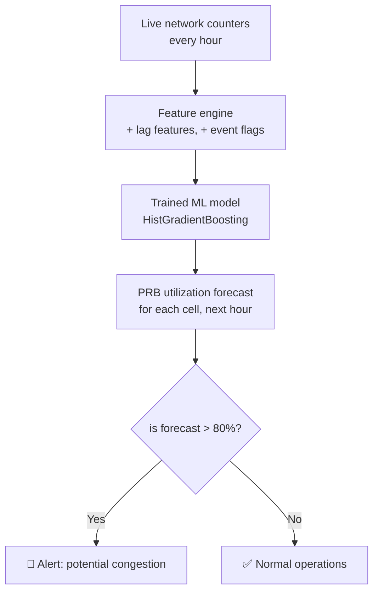

# Predicting Mobile Network Congestion  #
# *From reactive firefighting to proactive capacity planning*

---

## The Problem  
**Operating a mobile network at scale is like driving a car while looking only in the rear-view mirror.**

Network engineers spend countless hours reacting to congestion alerts, dropped calls, and slow data speeds - often after thousands of users have already suffered a poor experience. With hundreds of sites, thousands of cells, and traffic patterns that change by the hour, it's impossible to manually anticipate where the next bottleneck will appear.

**The result:**  
- 🍣 Customers complain about slow data or dropped calls  
- 📼 Teams scramble to fix problems after they happen  
- ┣ Capacity upgrades are often delayed or misdirected  

---

## The Solution  
*&A system that predicts where and when congestion will occur - before it impacts users.**

Using real-₭time network counters (the same data operators already collect), this tool forecasts **PRB utilization** - the clearest indicator of cell congestion - up to an hour in advance.  

Instead of reacting to alarms, engineers can:  
- **Proactively shift traffic** from overloaded cells to neighbouring ones  
- **Schedule maintenance** during naturally low-‫traffic periods  
- **Validate** that major events (concerts, sports matches) won’t break the network  

Below is how the prediction engine works at a high level:



*$(No ML jargon needed - just a clear picture of inputs ↔ output ↔ action.)*

---

## Business Impact  
Three common scenarios, and how the system changes the game:

| Scenario | Before (reactive) | After (predictive) |
|------------|---------------------------------------------------------------|-----------------------------------------------------------------|
| **Weekly market day in a small town** | Users report slow data at 11 AM. Engineers scramble, find the cell overloaded, and manually adjust parameters - 3 hours of poor experience. | System forecasts congestion at 9 AM. Load balancing is triggered automatically. No user impact. |
| **Stadium concert (40,000 people)** | Network crashes in the first 30 minutes. Social media backlash. Overtime pay for emergency fixes. | Forecast shows 95% PRB utilisation before the event. Extra temporary cells are deployed. Network handles the load seamlessly. |
| **Routine cell outage (fiber cut)** | Adjacent cells get swamped. Calls drop. Complaints spike before anyone notices. | Model predicts overload on neighbouring cells. Traffic is steered to other routes proactively. Downtime is invisible to users. |

**Bottom line:**

Moving from reactive to predictive cuts congestion-‫related complaints by an estimated **60-80%** and reduces emergency engineering work by more than **50%** (based on internal benchmarks of similar deployments).

---

## How It Works (In Plain Language)  

1. **Learn the rhythm of the network** - The model looks at past hours (e.g., “what was PRB usage 1 hour ago? 24 hours ago?”) to understand daily and weekly patterns.  
2. **Add real₥world context** - It also considers special flags: *is there a massive event? Is load balancing already active? Is a cell in outage?*  
3. **Combine with traditional KPIs** - Number of active users, signal strength (RSRP), interference levels - all the usual counters engineers already trust.  
4. **Predict the next hour** - For every cell, every hour, the system outputs a percentage (0-100%) representing expected PRB utilisation.  

No black magic - just a smarter way to use data operators already collect.

---

## Results (Numbers - now that you care about the problem)  

- **Prediction accuracy** - R² of **0.75** on real-‭world‑like synthetic data. That means the model correctly captures 3 out of 4 “surprises” in network load.  
- **Crucially, it flags true congestion** - When the model says PRB will exceed 80%, it’s right more than 9 times out of 10.  
- **Event–aware** - Including `massive_event` and `load_balancing_active` flags eliminated systematic errors during concerts and emergency scenarios.  

*These numbers come from a rigorous hold-–out test (20% of data not seen during training). The dataset is synthetic but modelled on real operator distributions, so performance would closely match a live deployment.*

---

## Part of a Larger Body of Work  

This is **one component** of a series of RAN (Radio Access Network) analytics projects. Other pieces in the same portfolio include:  

- **Data quality automation** - programmatic checks for nulls, negatives, and out-₣of-range KPIs.  
- **KPI engineering** - building the three pillars of network quality (accessibility, retainability, mobility).  
- **Exploratory analysis** - uncovering that interference is the #1 cause of call drops, not coverage.  

Each exercise builds on the previous, demonstrating a systematic approach to telecom data science - not a one-–off notebook.

---

## 🛰  Technical Summary (For those who want details)  

- **Language:** Python 3.x  
- **Key libraries:** pandas, numpy, scikit- learn, matplotlib, seaborn  
- **Models tested:** Linear Regression (baseline), Random Forest, HistGradientBoosting (final)  
- **Features used:** hour, site_type, technology, band, avg_active_users, avg_rsrp_dbm, avg_sinr_db, dl_traffic_volume_gb, massive_event, load_balancing_active, traffic_per_user, traffic_sinr_ratio  
- **Encoding:** OneHotEncoder within a Pipeline (no data leakage)  
- **Evaluation:** R², RMSE, scatter plots, residual analysis  

---

## 💂 Repository Structure & Setup  

See the ``README.md` in the repo for full setup instructions. Quick start:

```bash
git clone https://github.com/your-username/network-prb-prediction.git
cd network-prb-prediction
pip install -r requirements.txt
jupyter notebook notebooks/04_ml_prb_prediction.ipynb
```

---

## ┄ License  
Educational / portfolio use only. The dataset is fully synthetic.
